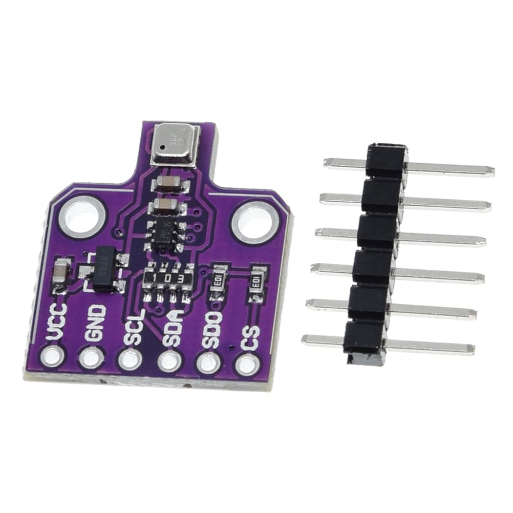

# BME680 Sensor
Code snippets for BME680 Sensor (temperature, humidity, barometric pressure, and VOC gas).

<picture>
  
</picture>

Sensing capabilities:
* Temperature
* Humidity
* Pressure
* Gas
* Approx. Altitude

Watch the implementation of this code on our [YouTube channel](https://www.youtube.com/@Roboticxps)

To get your own BME-680 sensor, visit our online store: (Product Page)

* [BME680 Sensor - Temperature, Humidity, Pressure and Gas](https://roboticx.ps/product/bme680-sensor-temperature-humidity-pressure-and-gas/)

----

Follow us on social media:

* Facebook: https://www.facebook.com/Roboticxps
* Instagram: https://www.instagram.com/roboticx.ps
* YouTube: https://www.youtube.com/@Roboticxps
* LinkedIn: https://www.linkedin.com/company/roboticx
